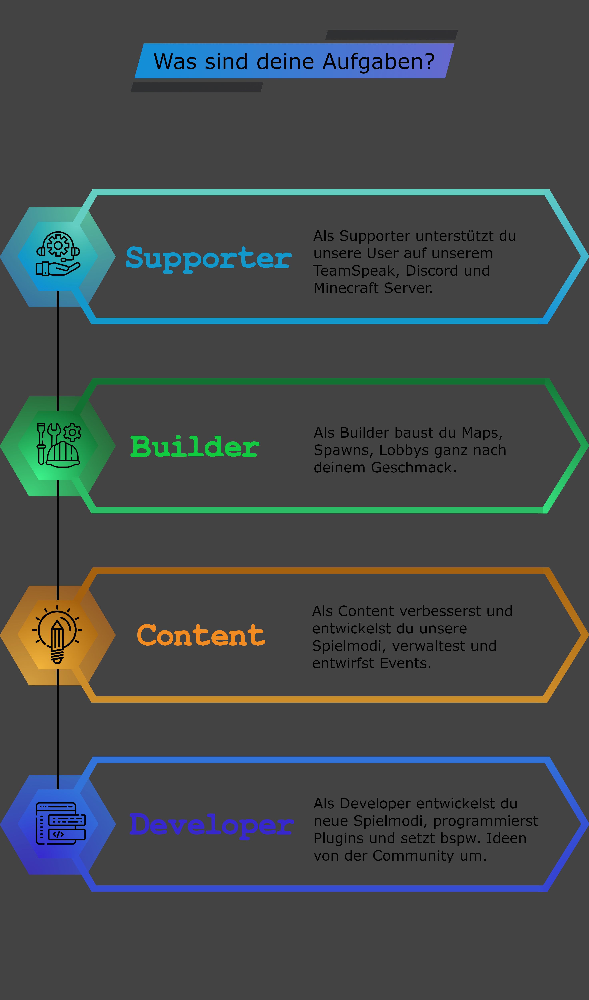

---
layout:
  title:
    visible: true
  description:
    visible: false
  tableOfContents:
    visible: true
  outline:
    visible: true
  pagination:
    visible: false
---

# ❓ Bewerbung

Du willst dich auf unserem Netzwerk bewerben? - Dann bist du bei uns herzlich willkommen :smile:\
Zuerst kannst du dir gerne diese kleine Grafik anschauen. Hier kannst du ganz grob zusammen gefasst sehen, was deine Aufgaben in den verschiedenen Bereichen sind.

<figure><figcaption>
Was sind deine Aufgaben?
</figcaption></figure>

Gehen wir nun genauer in die Thematik ein.

## Bewerbung als Supporter


Du möchtest dich als Supporter bewerben? - Das freut uns sehr, hier kannst du ganz neue Erfahrungen im Bereich Support machen.


Auch wenn Mevolent bösartig oder maliziös bedeutet, wollen wir, dass unsere Spieler ein schönes, wohlwollendes und ruhiges Spielerlebnis haben. Dies bedeutet, dass wir Beleidigungen, Provokation oder Bestechung nicht dulden. Genauso wenig wollen wir aber auch Scammer und Griefer auf dem Server dulden.\
Dies bedeutet viel Arbeit für das Support- und Moderationsteam.

Wie schon oben in der Grafik erwähnt, sind deine Aufgaben unsere Spieler zu unterstützen. Und dies nicht nur in Minecraft, sondern auch in Discord und ggf. im TeamSpeak. Dazu gehört auch der "Voice-Support". Deshalb solltest du ein geeignetes Mikro haben, bei dem der Spieler dich klar und deutlich verstehen kann.

**Sonstige Anforderungen:**

Mindestens 15 Jahre

Bei geeigneter geistigen Reife und einer "erwachsenen Stimme" machen wir auch ausnahmen. Unter 13 Jahren nehmen wir keine Supporter an.

Mindestonlinezeit von 6 Stunden

Wir wünschen uns eine Mindestonlinezeit von 6 Stunden auf unserem Minecraft Server. Du solltest unsere Spielmodi erkundet haben und wissen, was wir anbieten.

Geistige Reife

Du solltest eine gewisse Reife haben, um anderen Spieler gegenübertreten zu können, ohne kindisch zu sein.

Selbstständige Entscheidungen

Du solltest selbständig Entscheidungen treffen können. Dazu gehört auch, wann wird ein Spieler wegen Provokation gekickt und ab wann wird er gebannt. Du solltest sehen, was die gerechte Bestrafung für Spieler ist, die gegen die Regeln verstoßen.

Gutes Mikro + "Angenehme Stimme"

Es klingt etwas merkwürdig und du brauchst auch kein überteuertes Gaming-Mikro, aber man sollte dich dennoch gut verstehen können.\
Dazu solltest du keine "Kinderstimme" mehr haben. Dies tun wir nicht, um dich zu ärgern, es dient nur der dazu, dass du in einem "Voice-Support" ernst genommen wirst.

Kenntnisse in Minecraft und Discord

Du brauchst Minecraft nicht studiert haben, solltest jedoch gewisse Commands und Anwendungen kennen. Es gibt auch neue Spieler, die noch nie ein Spielmodus auf unserem Server gespielt haben.\
Auch in Discord solltest du wissen, wie man Spieler moved und mit diesen Interagiert.\
Natürlich bringen wir dir auch alles bei :relaxed:

