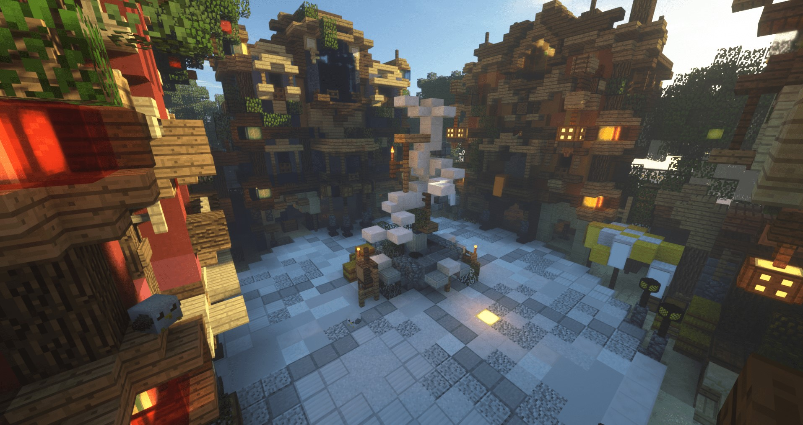

# 💡 Was ist Mevolent?


**Mevolent:** Was ist eigentlich Mevolent? Und wie komme ich da hin?


<figure><figcaption></figcaption></figure>

## Kurzbeschreibung

» Hast du 2 Minuten? Dann erkläre ich dir schnell, was Mevolent eigentlich ist? :hugging: «

Wir sind ein Minecraft Server oder auch eine Community, welche in den letzten Jahren über Berge und durch Täler gewandert ist :woozy\_face:. Mit vielen Höhen und Tiefen haben wir Probleme beseitigt und uns erfolgreich etwas aufgebaut.

» Aber was genau haben wir uns eigentlich aufgebaut? Von solchen Minecraft Servern gibt es doch etliche! «

Ja! Das stimmt. Es gibt viele kleinere und mittlere Minecraft Server. Und es ist schwer, da herauszustechen und wir geben unser Bestes, dies zu tun. Aber nicht auf eine arrogante und aufdringliche Weise. Wir legen Wert darauf, einen guten Draht zu unserer Community zu haben. Wir wollen euch das beste Spielerlebnis geben. Und das Ganze ohne Pay-To-Win Vorteil oder nervige Werbung.\
Wir wollen alle Eure Ideen:bulb:umsetzten und sind immer offen für neues.

» Du hast gesagt, ihr habt euch etwas aufgebaut, was genau? :thinking: «

Wir haben vieles gemacht. Auch wenn man das nach außen hin nicht viel mitbekommt :see\_no\_evil:, haben wir viel Zeit investiert. Nicht um schnell viel etwas zu haben, sondern um die Projekte, die wir uns vorgenommen haben zu perfektionieren. Leider sind wir auf ein Problem gestoßen. Und zwar können wir das alleine gar nicht machen :man\_shrugging:. Wir brauchen Euch! Ihr seid ein wichtiger Bestandteil Mevolents. Und ohne Euch würde es uns nicht mehr geben.\
Aber was haben wir jetzt eigentlich aufgebaut? Angefangen mit schlichten Spielmodi wie Creative und BuildFFA sind wir nun schon zu größeren Spielmodi wie BedWars gekommen.\
Es ist leichter, wenn Ihr Euch diese Spielmodi hier genauer anschaut und genau unter die Lupe nehmt. Vielleicht fällt Dir ja noch ein kleiner oder auch großer Fehler auf?

Ich freue mich auf jeden Fall, Dich auf unseren Server zu treffen.


[creative.md](../unsere-spielmodi/creative.md)

