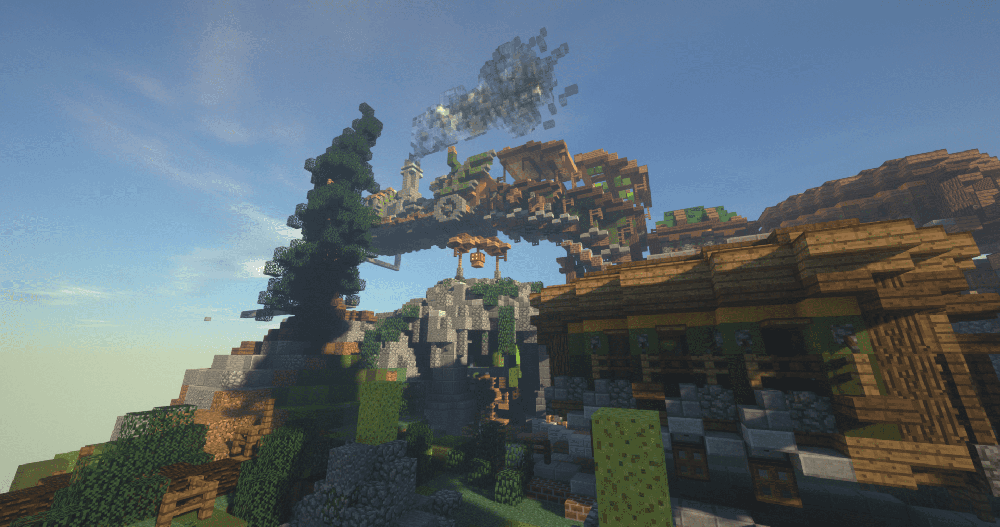
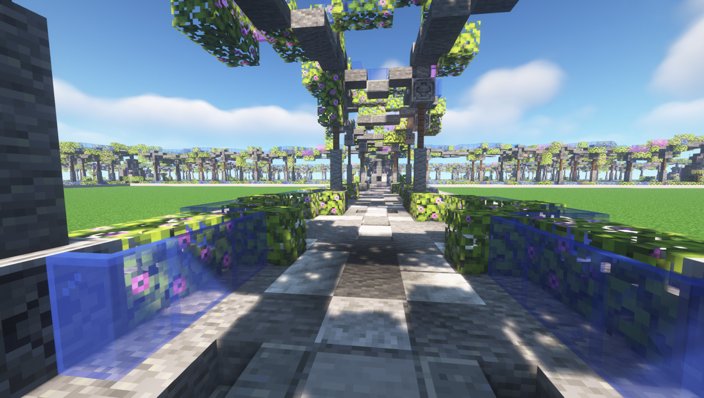
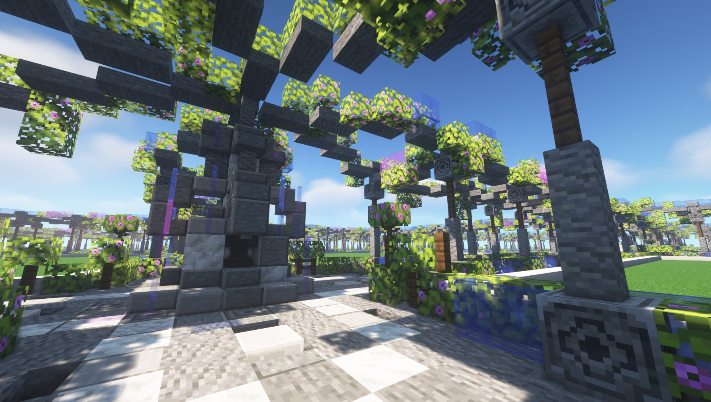
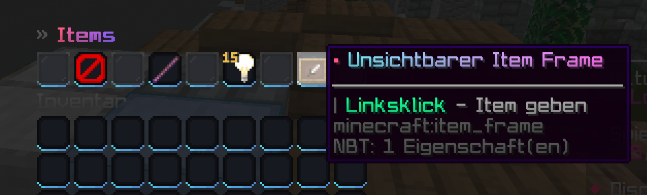
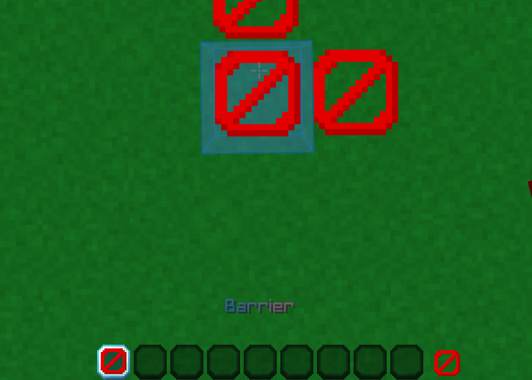

# ✨ Creative

## Creative - Spielidee

Wir bieten viele Spielmodi. Vom ruhigen Creative bis hin zum dramatischen BedWars. Und es werden noch mehr kommen.

<figure><figcaption>
Unser Creative Spawn
</figcaption></figure>

<figure><figcaption>
Unsere selbstgebauten Straßen
</figcaption></figure>

 

<figure><figcaption>
Auch mal von einer anderen Sichtweise
</figcaption></figure>


Unsere Straßen trennen die Grundstücke voneinander.


Hier kannst du im Creative-Gamemode deiner Kreativität ... nein ... das ist so der langweilige Standardspruch ... "Kreativität freien Lauf lassen" ... \
» Hier kannst du bauen, was du willst! « ... hm nein, auch nicht. Ich finde bestimmt noch einen coolen Spruch, der nicht langweilig ist.

Jedenfalls kannst du gigantische Bauwerke errichten, ohne dir Sorgen um fehlende Ressourcen oder Platz zu machen. Zusammen mit deinen Freunden oder seelenruhig allein, ohne dass dich jemand stört.

***

## Besondere Features

Der <mark style="color:green;">/items</mark> Command

Bei diesem Command öffnet sich eine GUI[^1], bei der du dir eine Barriere, einen Debug Stick, das Item Light oder einen unsichtbaren Item-Frame hohlen kannst.\
\
Mit einer Barriere kannst du eine "unsichtbare Wand" platzieren.\
Diese sieht man nur, wenn man auch eine Barriere in der Hand hält.

.png>)

## Commands

Hier sind alle Commands aufgelistet, welche du für den Creative Spielmodus brauchst.

Ich verwende hier immer den Begriff _<mark style="color:purple;">Plot</mark>_. Das ist das Grundstück, auf dem du dich austoben kannst.

<table><thead><tr><th width="271">Command</th><th>Beschreibung</th></tr></thead><tbody><tr><td>/p auto</td><td>Beanspruche ein freies Plot. Du musst nicht auf dem Plot stehen</td></tr><tr><td>/p claim</td><td>Beanspruche das Plot, auf dem du stehst. Es darf noch keinen Besitzer haben</td></tr><tr><td>/p delete</td><td>Lösche dein Plot</td></tr><tr><td>/p confirm</td><td>Bestätige eine Aktion, welche du <mark style="color:red;"><strong>nicht</strong></mark> mehr rückgängig machen kannst.</td></tr><tr><td>/p trust (Spielername)</td><td>Erlaube einem Spieler auf deinem Grundstück zu bauen und abzubauen. Er kann auf deine Kiste zugreifen. Dies funktioniert auch, wenn du <mark style="color:red;">Offline</mark> bist. </td></tr><tr><td>/p add (Spielername)</td><td>Erlaube einem Spieler auf deinem Grundstück zu bauen und abzubauen. Er kann diese, <strong>nur</strong> wenn du <mark style="color:green;">Online</mark> bist. </td></tr><tr><td>/p deny (Spielername)</td><td>Banne einen Spieler von deinem Grundstück.</td></tr><tr><td>/p remove (Spielername)</td><td>Entferne einen <a data-footnote-ref href="#user-content-fn-2">gebannten</a>, <a data-footnote-ref href="#user-content-fn-3">vertrauten </a>oder <a data-footnote-ref href="#user-content-fn-4">hinzugefügten </a>Spieler von deinem Plot.</td></tr><tr><td>/p kick (Spielername)</td><td>Kicke einen Spieler von deinem Plot.</td></tr><tr><td>/p clear</td><td>Leere dein Plot. (Es wird nicht gelöscht.) Es wird ein Backup erstellt, welches du wieder laden kannst.</td></tr><tr><td>/p delete</td><td>Lösche dein Plot.</td></tr><tr><td>/p i</td><td>Schaue dir die Information über dein Plot an.</td></tr><tr><td>/p v (Spielername)</td><td>Besuche ein Plot von einem anderen Spieler.</td></tr><tr><td>/p h </td><td>Teleportiere dich zu deinem Plot bzw. zu deinen Plots (Dazu wird dann noch eine <a data-footnote-ref href="#user-content-fn-5">Zahl angehangen</a>.)</td></tr><tr><td>/p middle</td><td>Teleportiere dich zum Mittelpunkt von deinem Plot.</td></tr><tr><td>/p merge</td><td>Verbinde zwei Plots, die du nebeneinander hast, miteinander. Die Straße wird dann verschwinden.</td></tr><tr><td>/p unlink</td><td>Trenne zwei verbundene Plots voneinander.</td></tr><tr><td>/p set home</td><td>Setzte den Spawn-Punkt für dein Plot. </td></tr><tr><td>/p alias set</td><td>Setzte einen Alias für dein Plot.</td></tr><tr><td>/p alias remove</td><td>Entferne einen Alias von deinem Plot.</td></tr><tr><td>/p flag set</td><td>Setzte eine Flag auf deinem Plot.</td></tr><tr><td>/p flag remove</td><td>Entferne eine Flag von deinem Plot.</td></tr><tr><td>/p toggle chat</td><td>Aktiviere oder Deaktivieren den Plot-Chat.</td></tr><tr><td>/p toggle time</td><td>Aktiviere oder Deaktiviere die Zeitveränderung auf deinem Plot.</td></tr><tr><td>/p backup save</td><td>Erstelle ein Backup von deinem Plot.</td></tr><tr><td>/p backup load</td><td>Lade ein Backup auf dein Plot.</td></tr><tr><td>/p backup list</td><td>Schaue dir alle Backups von deinem Plot an.</td></tr><tr><td>/ec</td><td>Öffne deine persönliche Enderchest.</td></tr><tr><td>/rename</td><td>Änder den Namen von einem Item.</td></tr><tr><td>/anvil</td><td>Öffne ein Amboss.</td></tr><tr><td>/cartography</td><td>Öffne einen Kartentisch.</td></tr><tr><td>/grindstone</td><td>Öffne einen Schleifstein.</td></tr><tr><td>/loom</td><td>Öffne einen Webstuhl.</td></tr><tr><td>/stonecutter</td><td>Öffne eine Steinsäge.</td></tr><tr><td>/smithingtable</td><td>Öffne einen Schmiedetisch.</td></tr><tr><td>/seen (Spielername)</td><td>Schaue dir an, wann ein Spieler das letzte Mal online war.</td></tr><tr><td>/schild</td><td>Ändere das Geschriebene auf einem platziertem Schild.</td></tr><tr><td>/home</td><td>Öffne das Home-Menu</td></tr><tr><td>/items</td><td>Öffne das Item-Menu</td></tr></tbody></table>

[^1]: Ein <mark style="color:blue;">GUI</mark> ist ein Inventar in Minecraft.\
    Ausgesprochen steht es für <mark style="color:blue;">G</mark>raphical <mark style="color:blue;">U</mark>ser <mark style="color:blue;">I</mark>nterface

[^2]: Siehe /p deny

[^3]: Siehe /p trust

[^4]: Siehe /p add

[^5]: Der Command würde dann so aussehen:\
    /p h 1\
    /p h 2\
    Falls du 2 Plots hast.
